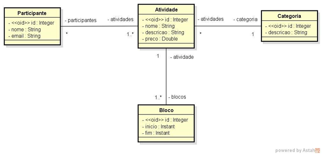
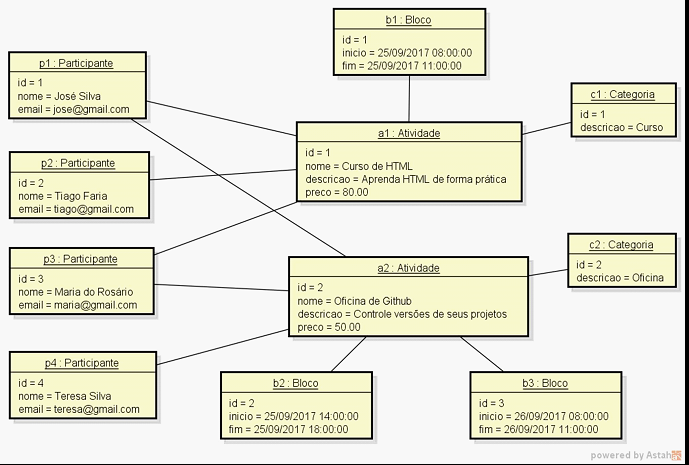

## Back-end Sistema Evento
Projeto de estudo de criação de api, onde uso as seguinte tecnologias:
#### Linguagens :
        Java jdk 17 
#### Gerenciamento de projetos :
        Maven
#### Frameworks :
        Springboot, Spring Data JPA
#### DB:
        Em ambiente de testes utilizo o banco de dados H2(em memória),
        e o Postgres em ambiente de desenvolvimento e produção.
### Configurações para inicialização:
       Execute o comando: mvn install para instalar as dependências do maven.
       Após baixar as dependências, execute a aplicação e a api estará rodando em http://localhost:8080.
       Acesso ao banco de dados: http://localhost:8080/h2-console.
### repositório: https://github.com/junior-brandao/sistema_evento
### 1- Visão geral do sistema
Construção de um sistema para gerenciar as informações dos participantes das atividades de um
evento acadêmico. As atividades deste evento podem ser, por exemplo, palestras, cursos, oficinas
práticas, etc. Cada atividade que ocorre possui nome, descrição, preço, e pode ser dividida em vários
blocos de horários (por exemplo: um curso de HTML pode ocorrer em dois blocos, sendo necessário
armazenar o dia e os horários de início de fim do bloco daquele dia). Para cada participante, deseja-se
cadastrar seu nome e email.

## 2 - Modelo Conceitual: 

## 3 - Intância dos dados para seeding
